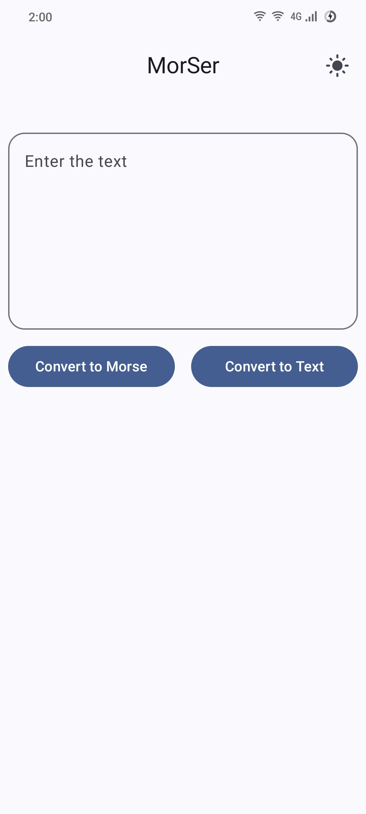
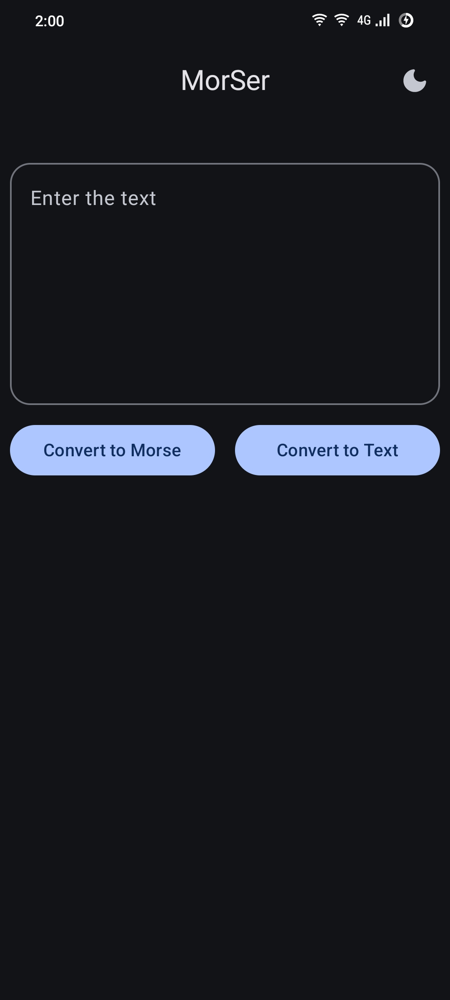
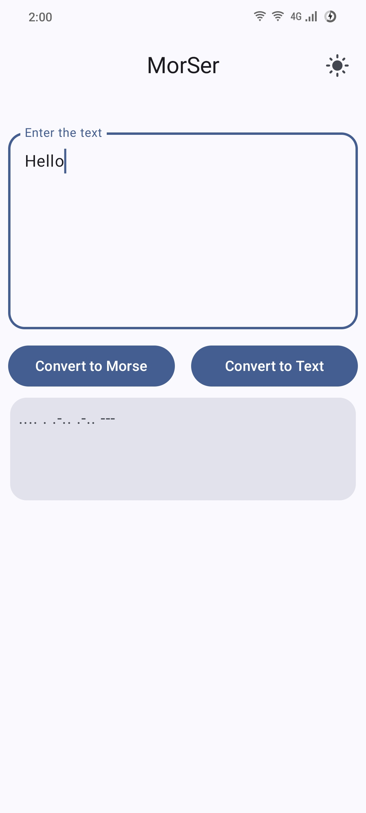
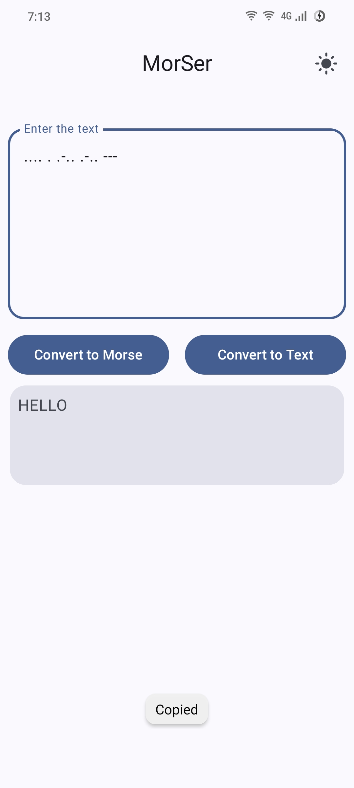

<!-- ---------- Header ---------- -->

  
  <h1>MorSer</h1>

MorSer: Text to Morse Code Converter with Material You.

<!-- ---------- Badges ---------- -->
  

    
    
     

<!-- ---------- Description ---------- -->

## Features

- [x] Material Design 3 (You)
- [x] Dark and light theme
- [X] Text to Morse code converter and vice versa
- [X] Simple user friendly app
- [X] Small app size
- [X] Predictive back gesture
- [X] Written in Jetpack Compose

<!-- ---------- Screenshots ---------- -->

## Screenshots

  
    
  
  

<!-- ---------- Contribution ---------- -->

## Building the App

***All contributions are very welcome!***

To build the app, you must use Gradle. Its highly recommended to use Android Studio for best
Experience. Also, update the Gradle version to match the one supported by your version of Android Studio.

If you're seeking a standalone text converter tool, you can visit: [ConverterUtil
](https://github.com/meashutoshhoon/MorSer/blob/master/app/src/main/java/com/jb/morser/ui/util/ConverterUtil.kt)

## License

MorSer is licensed under the [GNU General Public License
](https://www.gnu.org/licenses/gpl.html): You can use, study and share it as you want.